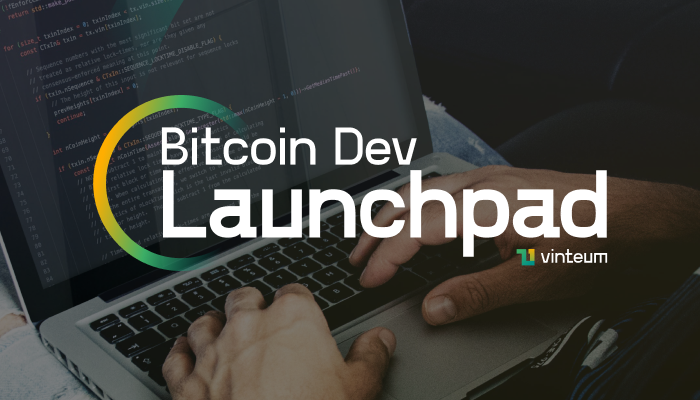

# Bitcoin Dev Launchpad by Vinteum

The [Bitcoin Dev Launchpad](https://vinteum.org/bdl/) is a 40-week program with
the goal to provide participants a solid foundation about the Bitcoin protocol
and FOSS development. With the Bitcoin Dev Launchpad Program we want to identify
talented programmers, improve their bitcoin knowledge and skills, and provide
the means to help them turn into full-time open source contributors if that's
aligned with their personal ambitions. The Bitcoin Dev Launchpad is built upon
the [Chaincode Labs'](https://learning.chaincode.com), [BTrust
Builders](https://www.btrust.tech/builders),
[B4OS](https://www.libreriadesatoshi.com/b4os), and [Summer of
Bitcoin](https://www.summerofbitcoin.org) programmes, adding to the educational
Bitcoin ecosystem.

## 😀 Join the community

Open source is fundamental to Bitcoin and this project is not different. Most
communications happen on the [Vinteum discord
server](https://discord.gg/N5RAvC8Zqk), come say hi!
